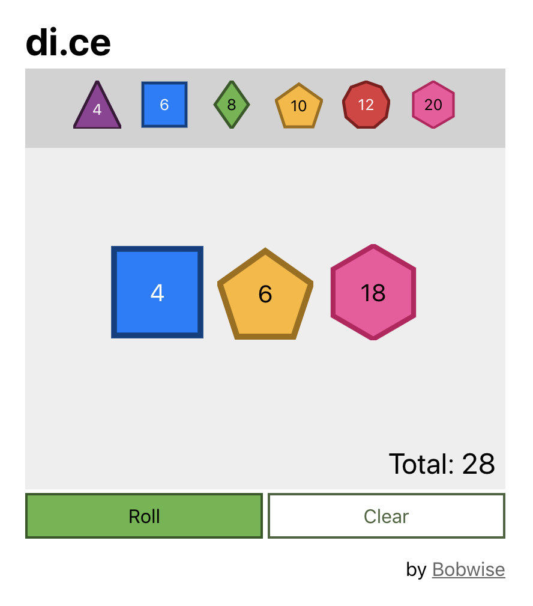

# 🎲 dice-roller

An accessible dice roller for everyone. 🎲♥

See it in action [here](https://bobwise.github.io/dice-roller/).

## Features

* Designed for keyboard support ⌨️
* Designed for screen reader support 🗣
* dark mode
* reduced motion

## Run it Yourself 👾

1. Fork this repo.
1. `clone` your forked repo with `git clone <yourRepoUrl>`.
1. [Install Node](https://nodejs.org/en/) if you haven't already.
1. `cd` into the project directory and run `npm install`.
1. Run `npm run start` in your project directory.
